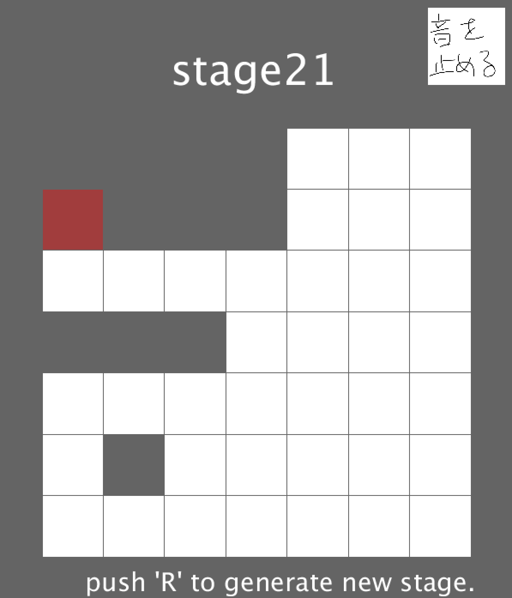

# one-stroke
Processingで作成した一筆書きのゲームです。

## 1. ゲームの説明

プレイヤーは赤い点を始点として、一筆書きで全てのマスを赤く塗ることが目的です。

ステージは全て自動生成されており、無限に遊び続けることが可能です。

後述するように、クリアできないステージが生成されたり、そうでなくとも自分がクリアできないなと思ったら、ステージの再生成がRキーで可能です。(もしRキーを押してもダメなら、Shift+Rを試してください。)

音楽は全て自分の声で作っています。

## 2. 技術的な話

##### 2-1. アルゴリズム

このゲームでは、マスの状態は塗れないマス(黒)、まだ塗られていないマス(白)、塗られたマス(赤)3種類あります。以降、黒マス、白マス、赤マスと呼びます。はじめ、全てのマスを塗られていないマスとします。そこから以下のアルゴリズムを走らせます。

1. ランダムな白マス(x,y)を1つ選ぶ。
2. そのマスの4近傍(x+1,y),(x,y+1),(x-1,y),(x,y-1)のうち、3つ以上の白マスと4近傍で連結しているマスが存在するなら、(x,y)のマスを黒マスにする。
3. 全ての白マスが4近傍で連結しているならば、1に戻る。

このアルゴリズムを実行すると、ある1つの白マスが黒マスに変化します。生成させたい黒マスだけ、このアルゴリズムを実行することで、一筆書きのステージが自動生成されています。

##### 2-2.グラフ理論との関係

今回扱っているマス目だけのステージは、マス目をノード、白マスと白マスの間は行き来できるのでエッジが貼られていると考えれば、ステージは無向グラフに落とし込めると思っています。また、あるグラフについて、それが一筆書きできるグラフかどうかの判定には、**半オイラーグラフ**かどうかを判定すれば良いことになります。半オイラーグラフは、ただ2つのノードの次数が奇数で、その他のノードの次数が偶数であるようなものです。つまり、このとき次数が奇数である2つのノードが、一筆書きにおける始点と終点の候補になります。

さらに、全てのノードはただ1回しか通れません。よって、始点と終点以外のノードの次数に関しては、ノードに入る分と、ノードから出る分しか存在してはいけないという制約、つまり2でなければならない制約にも注意しなければなりません。

しかし今回の問題は、与えられたステージが半オイラーグラフかどうかを判定するような単純なものではありません。今回の問題は、明らかに必要以上の辺が貼られたグラフが与えられたとき、そこから適切に辺を削除して半オイラーグラフを生成する問題であるということができます。実は2-1.で示したアルゴリズムは完全なものではなくて、クリアできないステージが生成されることがあります。

## 3. 課題

### 課題

ステージの自動生成を謳っていますが、現状5%程度の確率でクリア不可能なステージが生成されます。これについては解決方法が分からないです。ステージ再生成の機能も、これを解決するために作成しています。

## 4. ゲームのプレイ方法

`application.zip`を解凍してください。Mac, Windows32/64bit版の3つのフォルダがありますので、自分の環境に合わせたアプリを起動してください。

## 4. 著作権関係

私的利用を目的とする改変・再配布は構いませんが、公に向けての再配布は認めないことを明記します。

